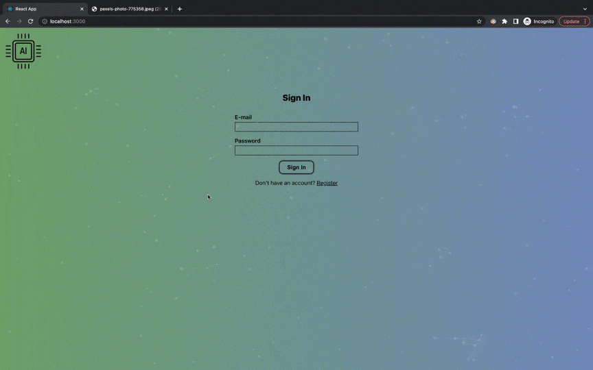

# Face Detector 

Fullstack project, with API endpoints and login access.
- It allows the user to Sign In (or register him/herself if it's a new user) 
- The user can then paste a link to an image with a human face on it
- That link will be sent in an AJAX request to the Clarify API, which will reply
with the location of the face
- A square will be drawn around the face, and the entry count of the user will
increment

### How to run:
Go to both the frontend and backend folders and run: \
`npm install` \
`npm start`
